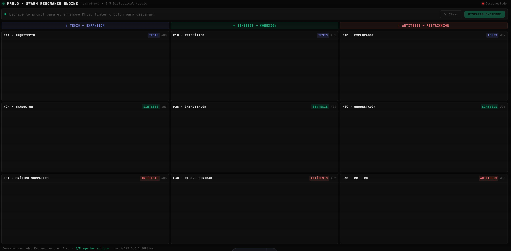

# MHLG Swarm Resonance Engine
### 3×3 Dialectical Mosaic — Gemma 4 · Ollama Local · Rust + Astro

> **One Human Gamer prompt → 9 concurrent AI responses** arranged in a
> Thesis / Synthesis / Antithesis dialectical grid, streaming in real-time.


---

## 1. Cognitive Philosophy

This system destroys the "single correct answer" illusion of conventional LLMs.
The Human Gamer acts as the final node of **attention and constructive interference**
by receiving a geometric 3×3 matrix of orthogonal, concurrent perspectives:

| Row | Mode | Agents |
|-----|------|--------|
| **TESIS** (Expansion) | Build, imagine, architect | F1A · Arquitecto, F1B · Pragmático, F1C · Explorador |
| **SÍNTESIS** (Connection) | Bridge, catalyze, orchestrate | F2A · Traductor, F2B · Catalizador, F2C · Orquestador |
| **ANTÍTESIS** (Restriction) | Critique, attack, question | F3A · Crítico Socrático, F3B · Ciberseguro, F3C · Critico |

All 9 agents are enriched with semantic context loaded from the JSON memory modules at startup.

---

## 2. Technical Architecture

```
Human Gamer → [Astro UI : 4321] ──WebSocket──► [Rust/Actix : 8080]
                                                        │
                                            Rayon parallel pool (9 threads)
                                                        │
                                    ┌───────────────────┼──────────────────┐
                                F1A─┤               F2A─┤              F3A─┤
                                F1B─┤               F2B─┤              F3B─┤
                                F1C─┤               F2C─┤              F3C─┤
                                    └───────────────────┴──────────────────┘
                                                        │
                                              [Ollama : 11434]
                                              gemma4:e4b + JSON context
                                                        │
                                   9 streaming responses ──► WebSocket ──► UI cells
```

**Stack:**
- **Inference**: Ollama local → `gemma4:e4b` (4.5B effective / 8B with embeddings)
- **Backend**: Rust (Actix-Web 4, Actix-WS) + Rayon parallel thread pool
- **Frontend**: Astro 4 (static output, vanilla JS, no framework overhead)
- **Memory**: JSON modules auto-loaded at backend startup, injected per-agent

---

## 3. Repository Structure

```
.
├── Cargo.toml                        # Rust project manifest
├── package.json                      # Node/Astro scripts
├── astro.config.mjs                  # Astro configuration
├── .gitignore
│
├── src/
│   ├── backend/
│   │   └── main.rs                   # Rust WebSocket server + Rayon swarm
│   ├── components/
│   │   └── MosaicGrid.astro          # 3×3 UI with streaming WebSocket client
│   ├── layouts/
│   │   └── Layout.astro              # HTML shell, fonts, CSS design tokens
│   └── pages/
│       └── index.astro               # Root page
│
├── process.py                        # JSON aggregator → Ollama dataset
├── mhlg_cli.py                         # CLI swarm interface (9 parallel agents)
│
└── *.json                            # Memory modules (language-gamers, biomimetic, etc.)
```

---

## 4. Quick Start

See **[SETUP.md](./SETUP.md)** for full prerequisites. Then:

```bash
# Terminal 1 — Ensure Ollama is running
ollama serve
ollama pull gemma4:e4b

# Terminal 2 — Rust backend (loads all JSONs at startup)
cargo run --release
# → WebSocket ready at ws://127.0.0.1:8080/ws

# Terminal 3 — Astro frontend
npm install
npm run dev
# → UI at http://localhost:4321
```

**Or use the Python CLI** (no Rust/Node needed):

```bash
pip install -r requirements.txt
python process.py          # Aggregate all JSONs into dataset (optional)
python mhlg_cli.py         # Terminal mode — colored console outputs
python mhlg_cli.py --serve # Server mode — Astro connects to ws://127.0.0.1:8080/ws
```

---

## 5. Memory Module Injection

All `.json` files in the repository root are automatically loaded:

- `biomimetic-language.json` — Bio-morphic semantic mechanics
- `linguistic-mapping-games.json` — Linguistic cartography modules
- `future-figures-projected.json` — Speculative linguistic futures
- `silice-language.json` — Silicon-substrate language modules
- `language-gamers-learners-*.json` — Synapse modules 13–240

The backend samples up to 20 entries (~3000 chars) per request and injects them
into each agent's system prompt as a **semantic anchor**.

---

## 6. Python Tools

| Script / Command | Purpose |
|------------------|---------|
| `python process.py` | Aggregate all JSONs → `mhlg_ollama_dataset.json` (9 variants per entry) |
| `python mhlg_cli.py` | **Terminal mode**: 1 prompt → 9 color-coded console outputs |
| `python mhlg_cli.py --serve` | **Server mode**: Python WebSocket server at `ws://127.0.0.1:8080/ws` — Astro connects to it as an alternative to the Rust backend |
| `python mhlg_cli.py --model llama3.2` | Use a different Ollama model |
| `python process.py --repo-path ./` | Specify custom JSON source path |

> ⚠️ **Name Collision Warning**: The CLI script is named `mhlg_cli.py`, **not** `ollama.py`.
> If it were named `ollama.py`, Python would shadow the installed `ollama` package with the local file,
> causing `AttributeError: module 'ollama' has no attribute 'show'`.
